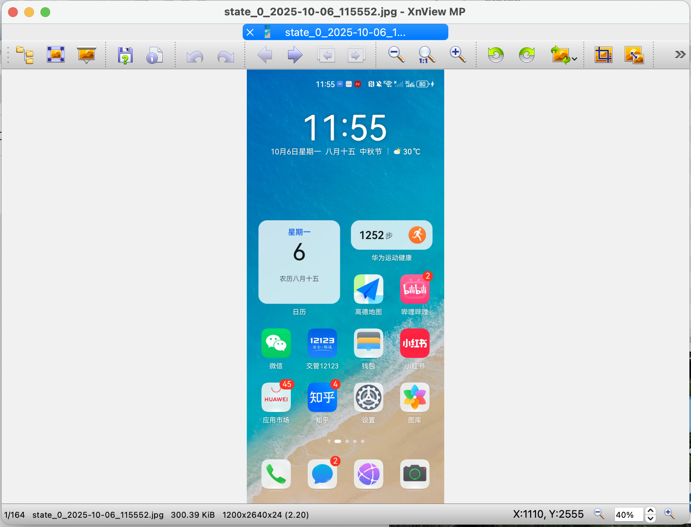

# KG-RAG-V2 Benchmark 

## Inputs/Outputs
#### Input: 
一批意图以及一个常用的app

#### Output: 
- 1.记录每一步执行的app截图
- 2.记录每一步具体的操作描述，如：点击xxx，输入xxx，向上/下/左/右滑动
- 3.记录每一步具体操作的bounding box（只针对点击操作），其他动作则置""
- 4.记录关键节点列表（按照主观感觉写）

#### 标注注意事项
- 先登录app后再进行标注
- 过滤掉弹窗等操作（如：进入首页后，系统弹出vip购买等弹窗，直接关闭弹窗即可，关闭弹窗这步的截图和动作都不需要记录）

## Platforms
- Android (30个垂类，每个垂类一个app）
- Harmony (15个垂类，每个垂类一个app）
- IOS (15个垂类，每个垂类一个app)

每个app标注15条意图

每个意图至少2个标注人员标注

## Variables
- intention: 需要标注的意图
- action_desp_list: 每一步操作的单步描述（点击xxx，输入xxx，向上/下/左/右滑动）
- bounding_box_list: 每一步具体操作的bounding box（只针对点击操作），其他动作则置""
- checkpoint_list: 完成意图所需的关键页面
- image_path_list: 每一张截图的相对路径

## Preparation

### Apk
包含所有需要的android的apk安装包
https://drive.google.com/drive/folders/1p-mkBJfkHjhZYqziaU5YYDhSoGCqHnRJ?usp=sharing

在虚拟机上，可通过adb install /Users/name/Downloads/xxx.apk (具体apk路径) 直接安装

### Android studio

需要安装Android studio以及adb，以使用安卓虚拟机

### XnViewMP

Windows/Mac系统都可以下载安装XnViewMP，用免费版即可

用XnViewMP打开图片，移动光标就可以在右下角找到对应X,Y坐标，作为grounding数据记录

<div align="center">
<p align="center">
  
</p>
</div>


## Examples:
```json
{
    "test_1": {
        "intention": "搜索并播放Taylor Swift的Love Story，并查看歌曲的详细信息",
        "action_desp_list": ["点击搜索框", "输入Taylor Swift Love Story", "点击搜索按钮", "点击搜索结果中第一个歌曲",
      "向左滑动", "向左滑动"],
        "bounding_box_list": [],
        "checkpoint_list": ["搜索结果页面", "歌曲播放页面", "歌曲详情信息页"],
        "image_path_list": ["screenshot/step_001.png", "screenshot/step_002.png", "screenshot/step_003.png",
        "screenshot/step_004.png", "screenshot/step_005.png", "screenshot/step_006.png", "screenshot/step_007.png"]
    },
    "test_2": {
        "intention": "搜索并播放Justin Bieber的Baby，并进行分享操作",
        "action_desp_list": ["点击搜索框", "输入Justin Bieber Baby", "点击搜索按钮", "点击搜索结果中第一个歌曲", 
        "点击右上角的分享按钮", "点击微信好友按钮", "点击列表中第一个联系人", "点击发送按钮", "点击返回酷狗音乐按钮"],
        "bounding_box_list": [],
        "checkpoint_list": ["搜索结果页面", "歌曲播放页面", "分享页面"],
        "image_path_list": ["screenshot/step_008.png", "screenshot/step_009.png", "screenshot/step_010.png",
        "screenshot/step_011.png", "screenshot/step_012.png", "screenshot/step_013.png", "screenshot/step_014.png",
        "screenshot/step_015.png", "screenshot/step_016.png", "screenshot/step_017.png"]
    }
}
```
