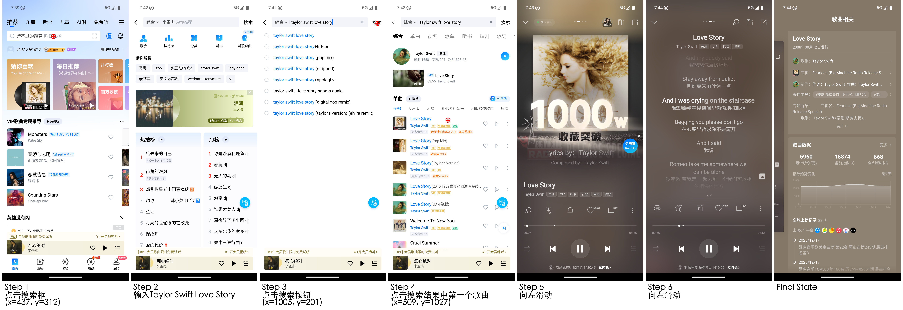
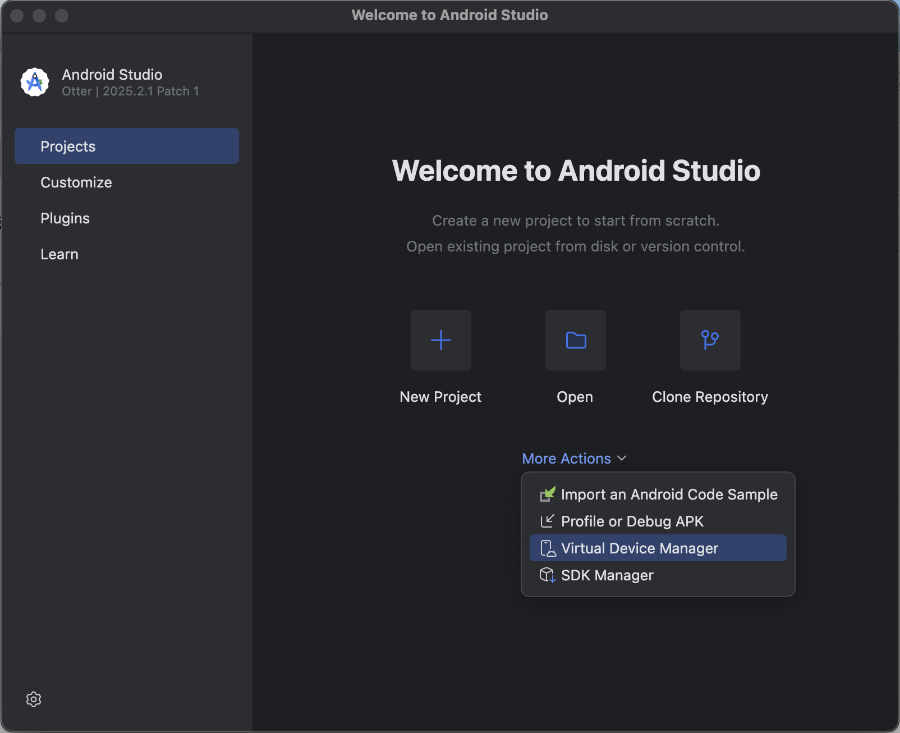
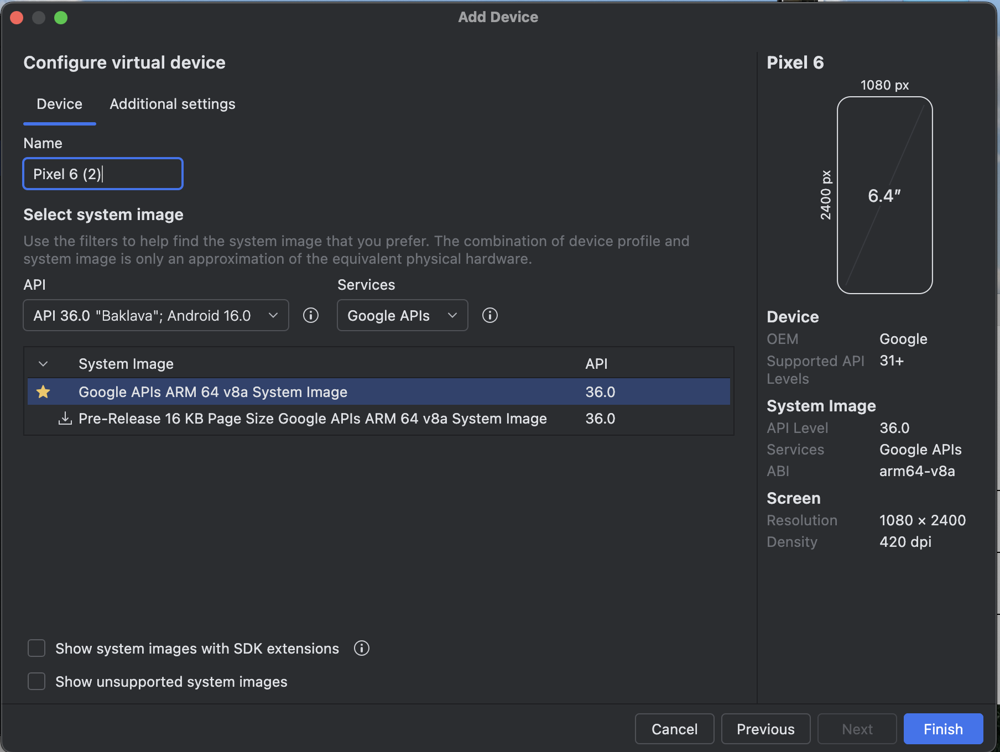
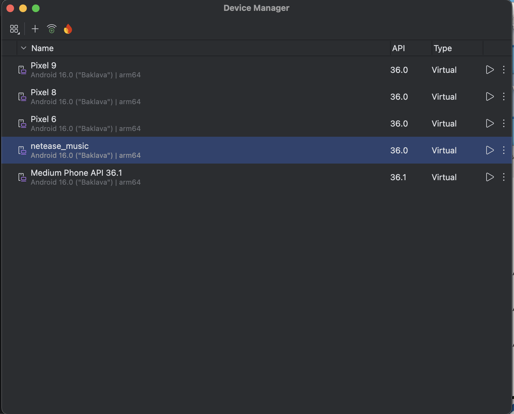

# KG-RAG-V2 Benchmark 

## Inputs/Outputs
#### Input: 
一批意图以及一个常用的app

#### Output: 
- 1.记录每一步执行的app截图以及路径
- 2.记录每一步具体的操作描述，如：点击xxx，输入xxx，向上/下/左/右滑动
- 3.记录每一步具体操作的控件的bounding box（[X1,Y1,X2,Y2]，两个坐标点，一个左上角，一个右下角，保证点击位置为bounding box的中心点，只针对点击操作），其他动作则置 []
- 4.记录关键节点列表（按照主观感觉写）

格式：
```text
app_name/
├── intent_1/         # 对应某个意图，文件夹名字与traj.json中的key保持一致
├───── step_001.png
├───── step_002.png
├───── ...
├── intent_2/
├── ...
├── traj.json/ 
```

#### Examples (traj.json):
```json
{
    "intent_1": {
        "intention": "搜索并播放Taylor Swift的Love Story，并查看歌曲的详细信息",
        "action_desp_list": ["点击搜索框", "输入Taylor Swift Love Story", "点击搜索按钮", "点击搜索结果中第一个歌曲",
      "向左滑动", "向左滑动"],
        "checkpoint_list": ["搜索结果页面", "歌曲播放页面", "歌曲详情信息页"],
        "bounding_box_list": [[44, 272, 844, 357], [], [951, 160, 1050, 214], [174, 996, 1058, 1121], [], []],
        "image_path_list": ["intent_1/step_001.png", "intent_1/step_002.png", "intent_1/step_003.png",
        "intent_1/step_004.png", "intent_1/step_005.png", "intent_1/step_006.png", "intent_1/step_007.png"]
    },
    "intent_2": {
        "intention": "搜索并播放Justin Bieber的Baby，并进行分享操作",
        "action_desp_list": ["点击搜索框", "输入Justin Bieber Baby", "点击搜索按钮", "点击搜索结果中第一个歌曲", 
        "点击右上角的分享按钮", "点击微信好友按钮", "点击列表中第一个联系人", "点击发送按钮", "点击返回酷狗音乐按钮"],
        "checkpoint_list": ["搜索结果页面", "歌曲播放页面", "分享页面", "分享成功页面"],
        "bounding_box_list": [[43, 230, 832, 309], [], [962, 126, 1054, 178], [165, 1049, 1049, 1202], 
        [980, 126, 1049, 187], [30, 1254, 156, 1420], [26, 945, 1063, 1076], [566, 1934, 866, 2047], 
        [130, 1320, 941, 1446]],
        "image_path_list": ["intent_2/step_008.png", "intent_2/step_009.png", "intent_2/step_010.png",
        "intent_2/step_011.png", "intent_2/step_012.png", "intent_2/step_013.png", "intent_2/step_014.png",
        "intent_2/step_015.png", "intent_2/step_016.png", "intent_2/step_017.png"]
    }
}
```

<div align="center">
    
</div>

#### 标注注意事项
- 先登录app后再进行标注
- 过滤掉弹窗等操作（如：进入首页后，系统弹出vip购买等弹窗，直接关闭弹窗即可，关闭弹窗这步的截图和动作都不需要记录）
- windows/mac 可以通过adb命令行对当前页面进行截图，直接保存到电脑
  ```python
  adb exec-out screencap -p > /Users/xudonglai/Desktop/dataset/kg_graph/benchmark/kugoumusic/screenshot/step_084.png
  ```

## Platforms
- Android (38个app）
- Harmony (5-10个app）
- IOS (3个app，音乐垂类）

每个app标注15条意图

每个意图至少2个标注人员标注

## Variables
- intention: 需要标注的意图
- action_desp_list: 每一步操作的单步描述（点击xxx，输入xxx，向上/下/左/右滑动，勾选xxx复选框）
- bounding_box_list: 记录每一步具体操作的控件的bounding box（[X1,Y1,X2,Y2]，两个坐标点，一个左上角，一个右下角，保证点击位置为bounding box的中心点，只针对点击操作），其他动作则置 []
- checkpoint_list: 完成意图所需的关键页面
- image_path_list: 每一张截图的相对路径

## Preparation

### Harmony/IOS
用真机，在app store下载app即可

标注后不要对app进行更新，测评会用同样的app版本

#### hdc
Harmony涉及hdc的安装（作用与adb一致）

下载地址：https://developer.huawei.com/consumer/cn/download/  安装Command Line Tools 6.0.1 Release

之后配置环境变量 export PATH=$PATH:/Users/xudonglai/Desktop/command-line-tools/sdk/default/openharmony/toolchains（可参考：https://developer.huawei.com/consumer/cn/doc/harmonyos-guides/hdc ）

安装成功的标志是，连接Harmony手机的情况下，在terminal运行 hdc list targets 显示对应手机的sn号
```python
(base) xudonglai@xudonglaideMacBook-Air ~ % hdc list targets
9CN0223B01031784
```

### Android
#### Apk
包含所有需要的android的apk安装包
https://drive.google.com/drive/folders/1p-mkBJfkHjhZYqziaU5YYDhSoGCqHnRJ?usp=sharing

在虚拟机上，在terminal可通过adb install /Users/name/Downloads/xxx.apk (具体apk路径) 直接安装

#### Android studio

需要安装Android studio以及adb，以使用安卓虚拟机

Android Studio: https://developer.android.com/studio?hl=zh-cn

一直点击next，应该会自动安装adb，第一次安装耗时会久一些（安装中如果有问题，可以直接搜索/gpt，相关内容很多）

安装成功后，Android Studio → More Actions → Virtual Device Manager
<div align="center">
  
</div>

在里边添加新的模拟机，选择 Pixel 6机型
<div align="center">
  
</div>

添加成功后，对应的device name会显示在界面上
<div align="center">
  
</div>


启动虚拟机，所有一切都安装成功的标志就是，在terminal运行 adb devices 命令时，显示对应的虚拟机的id（证明adb可以正常连接到手机并使用）
```python
List of devices attached
emulator-5554   device
```

### XnViewMP（用于coordinate标注）

Windows/Mac系统都可以下载安装XnViewMP，用免费版即可

用XnViewMP打开图片，移动光标就可以在右下角找到对应X,Y坐标，作为coordinate数据记录

<div align="center">
<p align="center">
  
</p>
</div>

